  

###

<h1 align="center"></h1>

###

  

###

  
  
  
  
  
  
  
  
  
  
  
  
  
  
  
  
  
  
  
  
  
  
  

###

  

###

###

###

<h1 align="center">About Me</h1>

###

<h3 align="center">🤖 Applied AI / Machine Learning Engineer  🎓 B.Tech CSE (AI & ML) @ GITAM University, Hyderabad  ⚙️ Building real-world AI systems, not just notebooks</h3>

###

  

###

<h2 align="center">I focus on Applied AI, ML systems, NLP, and MLOps-style pipelines — turning models into usable products.</h2>

###

  

###

  
  
  

###

  

###

<h1 align="center">🧠 Tech Stack</h1>

###

  

###

<h3 align="center">Languages Python · Java · C/C++ · JavaScript</h3>

###

  

###

<h3 align="center">Machine Learning (Regression, Classification, Clustering)  NLP · RAG · KMeans · PCA LLMs (OpenAI, Mistral) Frameworks & Tools scikit-learn · FastAPI · NumPy · Pandas Qdrant · REST APIs Git · GitHub · Docker (learning-by-doing)</h3>

###

  

###

<h3 align="center">Frameworks · Platforms · Deployment</h3>

  
  
  
   
  
  
  

  

###

<h1 align="center">💪 Contributions</h1>

###

  <picture>
    <source media="(prefers-color-scheme: dark)"
      srcset="https://raw.githubusercontent.com/AarushCh/AarushCh/output-3d-contrib/night.svg" />
    <source media="(prefers-color-scheme: light)"
      srcset="https://raw.githubusercontent.com/AarushCh/AarushCh/output-3d-contrib/day.svg" />
    
  </picture>

  

<h2 align="center">🐍 Contribution Flow</h2>

  <picture>
    <source media="(prefers-color-scheme: dark)"
      srcset="https://raw.githubusercontent.com/AarushCh/AarushCh/output/github-contribution-grid-snake-dark.svg" />
    <source media="(prefers-color-scheme: light)"
      srcset="https://raw.githubusercontent.com/AarushCh/AarushCh/output/github-contribution-grid-snake.svg" />
    
  </picture>

###

  

###

<h1 align="center">📊 GitHub Metrics</h1>

  

###

<h1 align="center">🛠 Featured Projects</h1>

###

<h3 align="center">🔹 Nexus Neural Search (RAG + Vector DB)</h3>

###

<h4 align="center">https://aarushch.github.io/Nexus-Neural-Search/        Hybrid semantic search using Qdrant + LLMs with generative outputs.</h4>

###

  

###

<h3 align="center">🔹 Intelligent Excuse Generator (FastAPI + NLP)</h3>

###

<h4 align="center">https://aarushch.github.io/Intelligent-Excuse-Generator/  Context-aware, multilingual AI system with ranking logic and automation.</h4>

###

  

###

<h3 align="center">🔹 User Segmentation AI System</h3>

###

<h4 align="center">https://github.com/AarushCh/User-Profiling-And-Segmentation  KMeans + PCA to segment 1,000+ users for targeted insights.</h4>

###

  

###

<h1 align="center">🏆 Experience & Achievements</h1>

###

<h3 align="center">🔹 Applied AI Intern – LaunchED Global  🔹 Software Development Intern (AIML) – BharatVersity  🔹 Smart India Hackathon – National Level (2023)  🔹 Smart India Hackathon – National Level (2024)  🔹 Deloitte Technology & Data Analytics Simulations (Forage)  🔹 Deloitte Technology Job Simulation (Forage)</h3>

###

  

###

<h1 align="center">📫 Let’s Connect</h1>

###

<h4 align="center">🌐 Portfolio: https://aarushch.github.io/Portfolio/  💼 LinkedIn: https://www.linkedin.com/in/ch-aarush-udbhav/  📧 Email: aarushch666@gmail.com</h4>

###

  

###

<h1 align="center">Profile Views</h1>

###

  

###

  

###